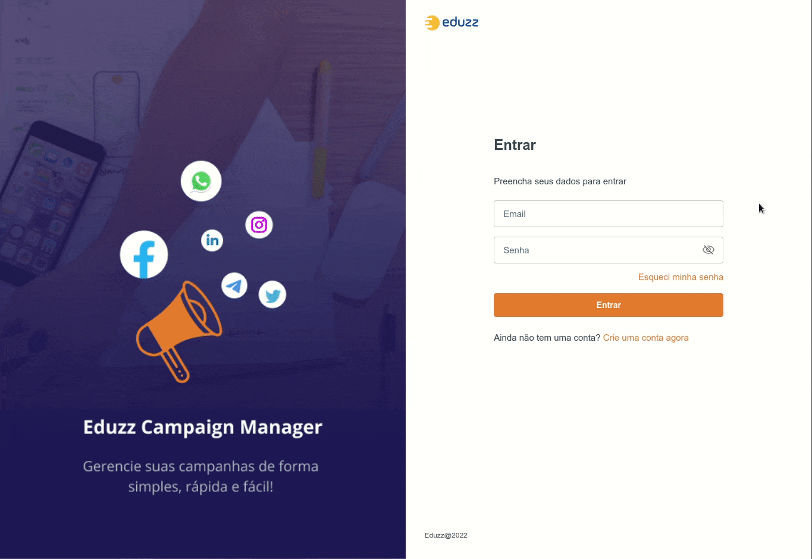

<div align="center" id="top"> 
  

  &#xa0;

  
</div>

<h1 align="center">Bootcamp Eduzz - Projeto principal</h1>

<p align="center">
  

  

  

   

   
</p>

Status

<h4 align="center"> 
	🚧  Bootcamp Eduzz - Projeto principal 🚀 Under construction...  🚧
</h4> 

<hr> 

<p align="center">
  <a href="#dart-about">About</a> &#xa0; | &#xa0; 
  <a href="#sparkles-features">Features</a> &#xa0; | &#xa0;
  <a href="#rocket-technologies">Technologies</a> &#xa0; | &#xa0;
  <a href="#white_check_mark-requirements">Requirements</a> &#xa0; | &#xa0;
  <a href="#checkered_flag-starting">Starting</a> &#xa0; | &#xa0;
  <a href="#memo-license">License</a> &#xa0; | &#xa0;
  <a href="https://github.com/wsasouza" target="_blank">Author</a>
</p>

<br>

## :dart: About ##

Projeto desenvolvido durante o Bootcamp Eduzz, como projeto principal. Todo o conteúdo do projeto foi desenvolvido durante as mentorias. O objetivo do projeto é criar um sistema de gerenciamento de campanhas em redes sociais, que possibilite acompanhar o ROI (Retorno sobre o investimento) de forma rápida e fácil.

## :sparkles: Features ##

:heavy_check_mark: Cadastro de usuários;\
:heavy_check_mark: Autenticação;\
:heavy_check_mark: Recuperação de Senha;\
:heavy_check_mark: Cadastro de campanha;\
:heavy_check_mark: Edição de campanha;\
:heavy_check_mark: Deletar campanha;

## :rocket: Technologies ##

The following tools were used in this project:


- [Node.js](https://nodejs.org/en/)
- [React](https://pt-br.reactjs.org/)
- [TypeScript](https://www.typescriptlang.org/)
- [RabbitMQ](https://www.rabbitmq.com/)
- [Docker](https://www.docker.com/)
- [MySQL](https://www.mysql.com/)

## :white_check_mark: Requirements ##

Before starting :checkered_flag:, you need to have [Git](https://git-scm.com), [Docker](https://www.docker.com/) and [Node](https://nodejs.org/en/) installed.

## :checkered_flag: Starting ##

```bash
# Clone this project
$ git clone https://github.com/wsasouza/dio-eduzz-projeto-principal

# Access
$ cd dio-eduzz-projeto-principal

# Install dependencies
$ cd back-end && yarn 
$ cd front-end && yarn 
$ cd worker && yarn 

# Run the project
$ cd back-end && yarn start 
$ cd front-end && yarn start
$ cd worker && yarn start

# The backend will initialize in the port 8000 and frontend <http://localhost:3000>
```

## :memo: License ##

This project is under license from MIT. For more details, see the [LICENSE](LICENSE.md) file.


Made with :heart: by <a href="https://github.com/wsasouza" target="_blank">Walter Santos de Andrade Souza</a>

&#xa0;

<a href="#top">Back to top</a>
